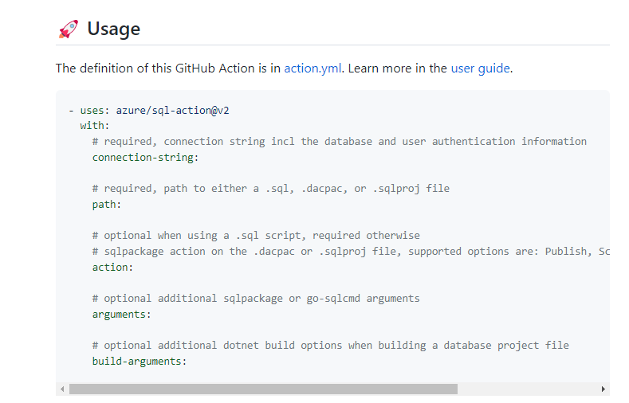
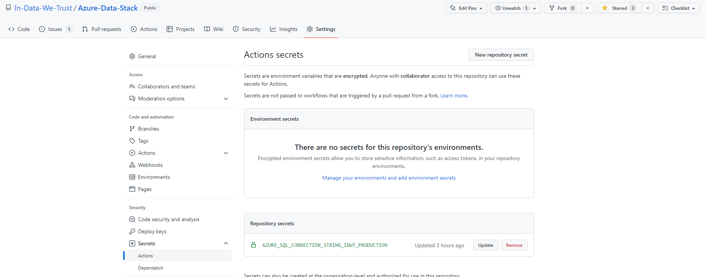

# Provides an Overview of how to set up github pipeline

## First - We need a user to be made

It is best practice to have a user made that will only be used for the github pipeline. This user will need full permissions on the database to make schema changes, make tables, drop tables, alter tables etc.

For our purposes we will name the user `githubuser` 

## Make a sql-workflow.yml file

This yml file configures the github action and when it needs to run. 

We only want it to run on the main/master branch so people can develop as needed in their own branches. Additionally it has been configured to only run and read files from a specific location. So we can use the rest of the repository to store all out SQL knowledge. - https://github.com/In-Data-We-Trust/Azure-Data-Stack/tree/main/database_ddls

The YML file used for in the repository is found here - https://github.com/In-Data-We-Trust/Azure-Data-Stack/blob/main/.github/workflows/sql-workflow.yml

We are leveraging a Github action called `sql-action` which is here - https://github.com/Azure/sql-action

Critically it's important to read the Usage/summary of the yml so we know how to apply it to our needs - https://github.com/marketplace/actions/azure-sql-deploy#-usage

As we only want to deploy from .sql scripts, we can keep and refer to those parts of the yml file.



If needed for further reading, the definition is here - https://github.com/Azure/sql-action/blob/master/action.yml


### Adding a secret 

The YML file needs a secret to access the Azure SQL DB. This has been created by adding it as a GitHub Action Secret:



The connection string template can be found from the Azure portal. Make sure to then update username and password before adding it as a secret!

```
Server=<server.database.windows.net>;User ID=<user>;Password=<password>;Initial Catalog=<database>`
```

