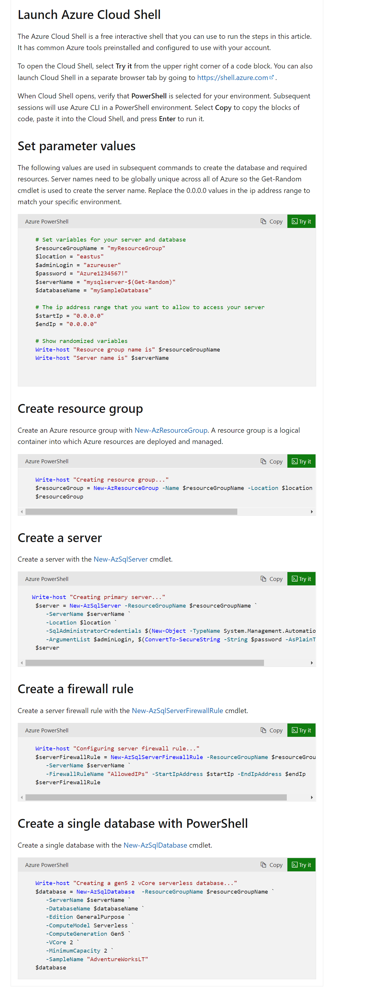
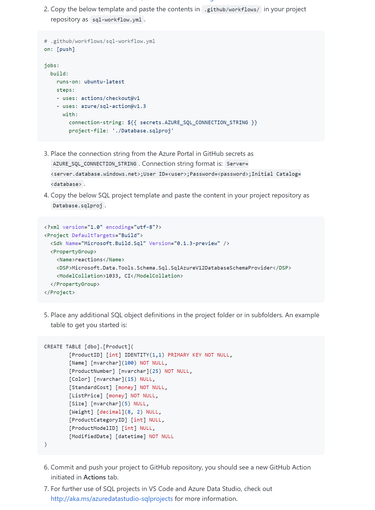

# How to use Github and Azure together

- [How to use Github and Azure together](#how-to-use-github-and-azure-together)
  - [References](#references)
  - [Investigations on how to create an Azure SQL DB](#investigations-on-how-to-create-an-azure-sql-db)
    - [Making the Azure SQL DB](#making-the-azure-sql-db)
    - [Linking the Azure SQL DB to GitHub Repo](#linking-the-azure-sql-db-to-github-repo)

## References

* https://github.com/marketplace/actions/azure-sql-deploy

## Investigations on how to create an Azure SQL DB 

* **Source** - https://github.com/marketplace/actions/azure-sql-deploy#-end-to-end-examples
  * Following the end-to-end example so it can be captured

### Making the Azure SQL DB

The standing up of the original Azure SQL DB Instance can be done in a variety of ways shown here (https://learn.microsoft.com/en-gb/azure/azure-sql/database/single-database-create-quickstart?tabs=azure-powershell&view=azuresql#create-a-single-database):

* Portal or
* Azure CLI or 
* Azure CLI (Sql Up) or
* Powershell

To keep it simple, I will opt to do it all in **powershell**

They have pre-defined templates we can use, which save a **lot** of time! 🚀

### Linking the Azure SQL DB to GitHub Repo

By Following steps 2-5 onwards on the following page (https://github.com/marketplace/actions/azure-sql-deploy#-end-to-end-examples) part I can then link my SQL database to my github repo. 

Critically I can make sure all schema changes are done through PR's and avoid scripts being manually copied and executed. 

