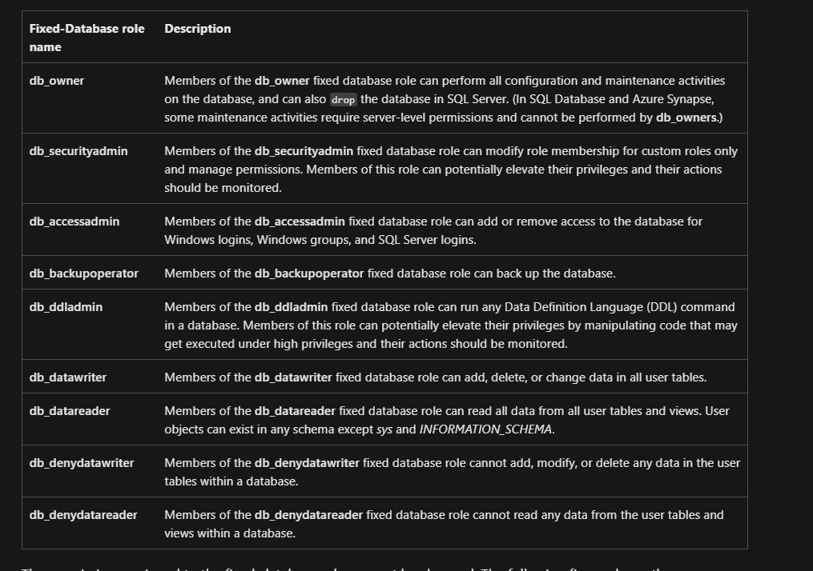

# Provides an Overview of how to grant access to a new user

Two Steps are required to grant access to a new user. These must be done whilst logged in as Global Admin

1. Create a login under the SQL Server Master tree
2. Create a user for the relevant databases and link it to the user
   - When executing, the relevant database, within the SQL Server must be selected. It is this database where the login can will be linked to access the database.
3. Add Role to user

## Overview of Database Roles

https://learn.microsoft.com/en-us/sql/relational-databases/security/authentication-access/database-level-roles?view=sql-server-ver16

*Screenshot from URL above of main roles*

